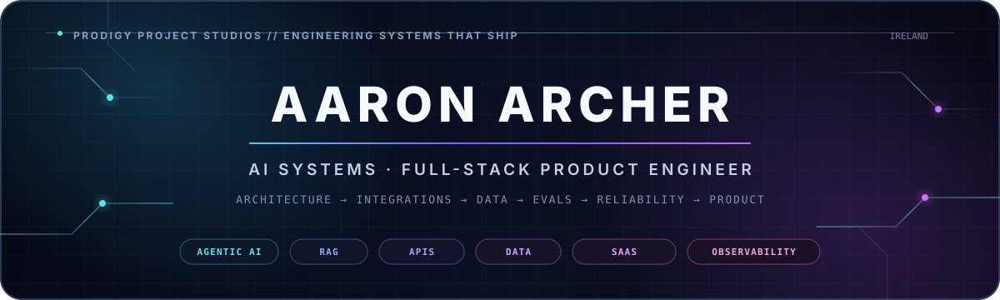
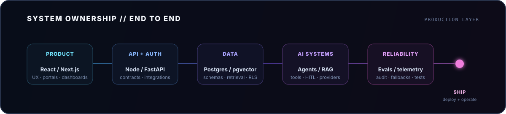

  

  
  
  
  

  I build the <b>production layer behind AI products and digital businesses</b> — architecture, APIs, agents, RAG, data, auth, integrations, reliability and the interface that ties the whole system together.

  AI-native in how I build. System-level in how I engineer.

---

## ⚡ Engineering systems that ship

I work across the complete product surface: from the data model and service boundaries to orchestration, evaluation, operational tooling and the final user experience. The goal is not a clever prototype. It is a system somebody can actually operate, inspect and extend.

  

<table>
<tr>
<td width="25%" valign="top"><b>🧠 Production AI</b> Agents · RAG · tool workflows · provider abstraction · HITL</td>
<td width="25%" valign="top"><b>⚙️ Backend Systems</b> APIs · auth · integrations · async workflows · service boundaries</td>
<td width="25%" valign="top"><b>🗃️ Data & State</b> PostgreSQL · pgvector · Supabase · MongoDB · typed contracts</td>
<td width="25%" valign="top"><b>🖥️ Product Engineering</b> React · Next.js · portals · dashboards · premium UX</td>
</tr>
</table>

---

# 🚀 Flagship Systems

<b>SELECTED WORK //</b> production AI, premium digital products and operational systems

## 🧠 AgentOps Command Center

<table>
<tr>
<td width="42%" valign="top">
<h3>Controlled multi-agent operations</h3>

A production-oriented architecture for making non-deterministic LLM workflows <strong>observable, grounded, evaluated and governable</strong>.

An 8-node typed agent state machine routes operational requests through specialist agents, pgvector retrieval, synthesis and a formal human approval gate. Every agent action, tool call and decision is persisted as a replayable audit record.

<strong>Engineering depth</strong>

<ul>
<li>8-node specialist-agent state graph</li>
<li>PostgreSQL + pgvector retrieval</li>
<li>structured Zod output contracts</li>
<li>human approval and audit trails</li>
<li>deterministic golden-scenario evaluations</li>
<li>provider usage, token and cost telemetry</li>
<li>contract-first OpenAPI architecture</li>
</ul>

<code>TypeScript</code> · <code>Node.js</code> · <code>Python</code> · <code>FastAPI</code> · <code>PostgreSQL</code> · <code>pgvector</code> · <code>OpenAI</code>

</td>
<td width="58%" valign="top">

  

<b>CONTROL PLANE // OPERATOR SURFACE</b>

<table>
<tr>
<td width="50%" valign="top"><b>8 NODES</b> typed orchestration</td>
<td width="50%" valign="top"><b>HITL</b> approval gates</td>
</tr>
<tr>
<td width="50%" valign="top"><b>RETRIEVAL</b> grounded context</td>
<td width="50%" valign="top"><b>EVIDENCE</b> replayable audit trail</td>
</tr>
<tr>
<td width="50%" valign="top"><b>EVALS</b> golden scenarios</td>
<td width="50%" valign="top"><b>TELEMETRY</b> usage + cost signals</td>
</tr>
<tr>
<td width="50%" valign="top"><b>CONTRACTS</b> Zod + OpenAPI</td>
<td width="50%" valign="top"><b>TRACES</b> persisted run history</td>
</tr>
</table>
</td>
</tr>
</table>

---

## ✦ AURIXA — Luxury Real Estate Intelligence

  
  

<table>
<tr>
<td width="58%" valign="top">

  

<b>EXPERIENCE LAYER // LUXURY DISCOVERY</b>

<table>
<tr>
<td width="50%" valign="top"><b>BUYER UX</b> cinematic property discovery</td>
<td width="50%" valign="top"><b>CONTENT OPS</b> CMS-powered inventory</td>
</tr>
<tr>
<td width="50%" valign="top"><b>AI ENRICHMENT</b> vision + copy workflows</td>
<td width="50%" valign="top"><b>INQUIRIES</b> captured and automated</td>
</tr>
<tr>
<td width="50%" valign="top"><b>MEDIA</b> Cloudinary delivery</td>
<td width="50%" valign="top"><b>OPERATIONS</b> automated handoff</td>
</tr>
</table>
</td>
<td width="42%" valign="top">
<h3>Client-facing product + operational backend</h3>

Commissioned full-stack platform for a premium Brazilian real-estate business, combining a cinematic buyer experience with the operational system behind it.

The delivered client system connected the React frontend to a <strong>Strapi / PostgreSQL API layer</strong> handling property content, Cloudinary media, AI enrichment and inquiry persistence / automation.

<strong>System highlights</strong>

<ul>
<li>integrated React ↔ Strapi architecture</li>
<li>property CMS + PostgreSQL</li>
<li>Cloudinary media pipeline</li>
<li>Restb.ai vision analysis</li>
<li>OpenAI property enrichment</li>
<li>sanitised inquiry API + n8n handoff</li>
</ul>

<code>React 19</code> · <code>TypeScript</code> · <code>Strapi 5</code> · <code>PostgreSQL</code> · <code>OpenAI</code> · <code>Restb.ai</code> · <code>Cloudinary</code> · <code>n8n</code>

</td>
</tr>
</table>

---

## ⚡ AI Products & SaaS Platforms

<table>
<tr>
<td width="50%" valign="top">
<h3>FlowCraft AI</h3>
<b>PROJECT 01 // WORKFLOW AUTOMATION</b>

  
<b>Visual AI workflow automation platform.</b> Users compose multi-step DAGs on a React Flow canvas; the server topologically sorts and executes nodes against OpenAI, Anthropic and Gemini while persisting execution state.
  
<b>Inside:</b> custom agents · multi-provider abstraction · server-side DAG execution · WebSockets · execution logs · credits · Stripe subscription scaffolding.
  
<code>React Flow</code> <code>TypeScript</code> <code>Express</code> <code>PostgreSQL</code> <code>Drizzle</code> <code>Stripe</code>
  
<a href="https://github.com/ProdigyProjectStudios/flowcraft-ai">Repository →</a> · <a href="https://ai-workflow-master.digitalprodigy.dev">Live demo →</a>
</td>
<td width="50%" valign="top">
<h3>Flow Analytics</h3>
<b>PROJECT 02 // DECISION INTELLIGENCE</b>

  
<b>AI-powered agency analytics SaaS.</b> Consolidates client reporting, executive insights, ROI modelling, competitor analysis and white-label tooling behind a tier-aware product architecture.
  
<b>Inside:</b> hardened server-side LLM proxy · Supabase/RLS · subscription feature gating · analytics dashboards · Stripe · integration marketplace.
  
<code>React 19</code> <code>TypeScript</code> <code>Express</code> <code>Supabase</code> <code>PostgreSQL</code> <code>AI analytics</code>
  
<a href="https://github.com/ProdigyProjectStudios/flow-analytics">Repository →</a> · <a href="https://flow-analytics.replit.app/">Live demo →</a>
</td>
</tr>
</table>

---

## 🛰️ NEXUS AI Assets

<b>CLIENT OPERATIONS // DELIVERY INFRASTRUCTURE</b>

<table>
<tr>
<td width="43%" valign="top">
<h3>Client operations as a product</h3>

A full-stack client-operations platform for agencies and AI service businesses: project delivery, onboarding, roadmaps, milestone payments, asset management, real-time communication and a grounded AI support agent.

<strong>Built around real operational workflows</strong> rather than a static dashboard — client/admin roles, live project state, messaging, file delivery and server-generated AI context all live in one system.

<code>React 19</code> · <code>Express</code> · <code>MongoDB</code> · <code>JWT</code> · <code>Socket.io</code> · <code>OpenAI</code> · <code>Resend</code> · <code>AWS S3</code>

</td>
<td width="57%" valign="top">

  

<b>OPERATIONS LAYER // CLIENT DELIVERY</b>

<table>
<tr>
<td width="33%" valign="top"><b>PROJECTS</b> live delivery state</td>
<td width="33%" valign="top"><b>PEOPLE</b> client + admin roles</td>
<td width="34%" valign="top"><b>CONTEXT</b> grounded AI support</td>
</tr>
</table>
</td>
</tr>
</table>

---

# 🔬 Under the Hood

<b>THE SYSTEMS THINKING BEHIND THE INTERFACE</b>

<b>🧠 Agentic AI, RAG & tool workflows</b>

 
I design agent systems around explicit state, typed outputs and inspectable boundaries — not opaque chains of prompts. That includes specialist-agent routing, retrieval with pgvector, tool execution, provider abstraction, confidence-aware fallbacks, human approval gates and complete audit trails.

<b>🧪 Evaluations, observability & reliability controls</b>

 
Production AI needs a way to fail visibly. I build deterministic scenarios, schema validation, telemetry, token/cost tracking, fallback paths, persisted run history and operator-facing evidence so behaviour can be reviewed rather than guessed at.

<b>⚙️ Full-stack product architecture</b>

 
Authenticated portals, dashboards, payments, CMS, APIs, background workflows, databases and third-party integrations. I work across frontend and backend boundaries so the product behaves like one system instead of a collection of disconnected components.

<b>🔌 Integrations & operational workflows</b>

 
REST APIs, webhooks, Cloudinary/S3 media, Stripe, Twilio, n8n, email, AI providers and external services — designed with server-side credential boundaries, validation, error handling and persistence around the integration points.

---

# 🛠️ Production Toolchain

<b>TOOLS SELECTED FOR SHIPPING RELIABLE, PRODUCTION-GRADE SYSTEMS</b>

### AI & orchestration

### Backend & data

### Product engineering

### Infrastructure & integrations

---

## Build the hard part.

**AI systems · SaaS architecture · authenticated products · APIs · integrations · operational platforms**

I am strongest when I can own an implementation stream end-to-end: architecture, data flow, integrations, testing, reliability and getting the complete product shipped.

  

Architecture over hype. Evidence over demos. Systems that can actually be operated.

